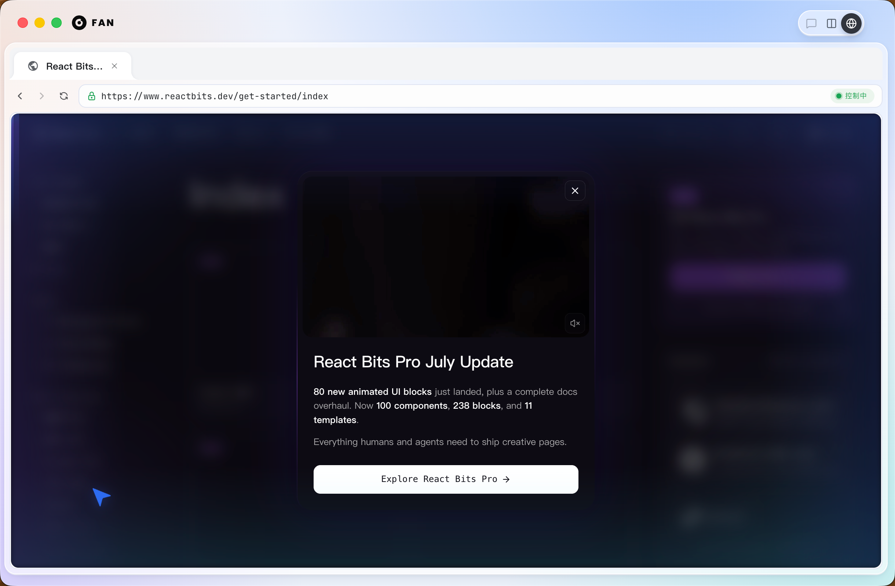
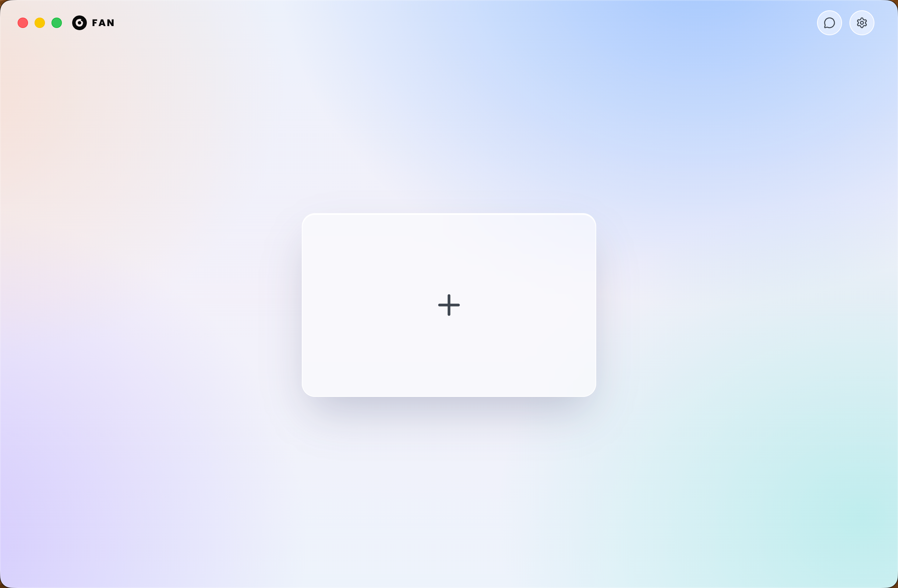

# Fan Browser Runtime

**English** · [简体中文](README.zh-CN.md)

[](LICENSE)

The browser runtime layer of **Fan Agent**.

Fan Browser Runtime is an agent-first local browser runtime: visible sessions,
stable observations, snapshot-bound actions, and safety policies for AI agents
that need to operate a real browser.

**Build with Fan Agent at [fandcode.com](https://fandcode.com).**

<p align="center">
  
  
</p>

## Why

Most browser automation tools are built around scripts. Fan Browser Runtime is
built around agents.

It focuses on the parts agents need in production:

- Visible browser sessions
- Stable page observations with `snapshotId`
- Stale-action rejection before unsafe clicks or typing
- Human handoff for login, CAPTCHA, payment, and sensitive flows
- Policy hooks for navigation, network, downloads, and high-risk actions
- Protocol-first design for CLI, SDKs, MCP, and product integrations

This project is part of the Fan ecosystem and is designed to make Fan Agent
easier to understand, extend, and adopt.

## Current Status

This repository currently provides the open-source project skeleton and runnable
CLI MVP. The Electron/CDP runtime is intentionally gated behind provenance
review before Fan Desktop code is imported.

Available now:

- Protocol package
- Runtime interface
- Memory runtime
- JSON-RPC handler
- Node client
- CLI MVP
- Tests, CI, license, NOTICE, and provenance docs

## Quick Start

```bash
npm install
npm run preflight
npm run example
```

CLI smoke test:

```bash
npm run dev -- open https://example.com
npm run dev -- observe
npm run dev -- click 1 --snapshot <snapshotId>
npm run dev -- screenshot --out artifacts/shot.png
```

Use `--json` for machine-readable output.

## Packages

```text
packages/protocol      Public types, JSON-RPC methods, JSON Schema
packages/runtime       Runtime interface, policies, memory runtime
packages/node-client   TypeScript JSON-RPC client
apps/cli               Local CLI
```

## Example

```ts
import { createMemoryBrowserRuntime } from "fan-browser-runtime";

const runtime = createMemoryBrowserRuntime();
const session = await runtime.createSession();
const observation = await runtime.navigate(session.sessionId, "https://example.com");

await runtime.click(session.sessionId, {
  index: 1,
  snapshotId: observation.snapshotId
});
```

## Roadmap

- Electron `WebContents` runtime
- CDP target management
- DOM and accessibility snapshots
- MCP server
- Python SDK
- Human handoff demo
- Trace and replay tools

## Fan

Fan Browser Runtime is one piece of Fan Agent.

Learn more: [fandcode.com](https://fandcode.com)

## License

Apache-2.0. See [LICENSE](LICENSE) and [NOTICE](NOTICE).
